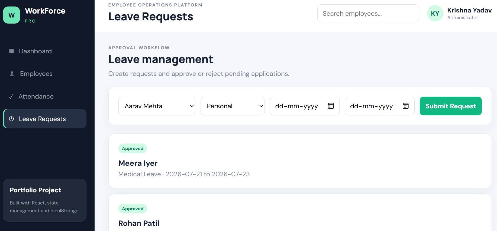
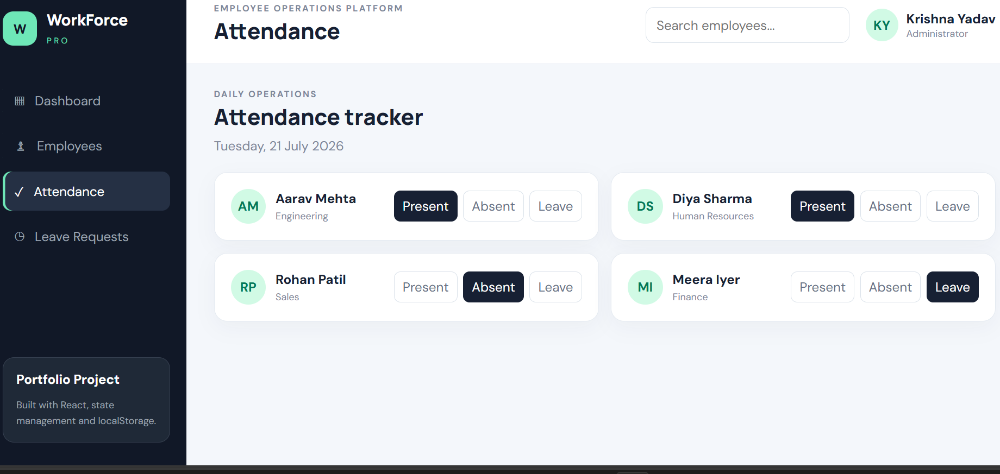
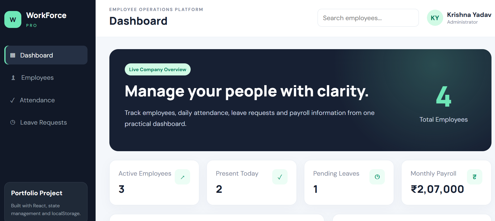

# WorkForce Pro — Employee Management System

# WorkForce Pro — Employee Management System

🌐 **Live Demo:** https://workforce-pro-employee-management-5sq2ou99m-krishna-yadav2.vercel.app

📂 **GitHub Repository:** https://github.com/krishna12-git/workforce-pro-employee-management

A functional employee operations dashboard built with React and Vite.

A functional employee operations dashboard built with React and Vite.

## Features

- Dashboard with live employee, attendance, leave and payroll statistics
- Add, edit, delete and search employees
- Mark daily attendance as Present, Absent or Leave
- Create, approve and reject leave requests
- Responsive business dashboard design
- Data persistence using browser localStorage
- Form validation and computed statistics


## 📸 ScreenshotsS

### Dashboard


### Employee List


### Attendance


### Leave Management



## Technology

- React
- JavaScript
- Vite
- CSS
- Browser localStorage

## Run locally

```bash
npm install
npm run dev
```

Open the local URL shown in the terminal.

## Production build

```bash
npm run build
```

## Portfolio description

WorkForce Pro is an employee management dashboard designed for small and
medium businesses. It centralizes employee records, attendance tracking,
leave approvals and payroll summaries in one responsive application.

## Future improvements

- Node.js and Express backend
- MongoDB database
- Authentication and role-based access
- Export reports to PDF/CSV
- Real-time notifications
